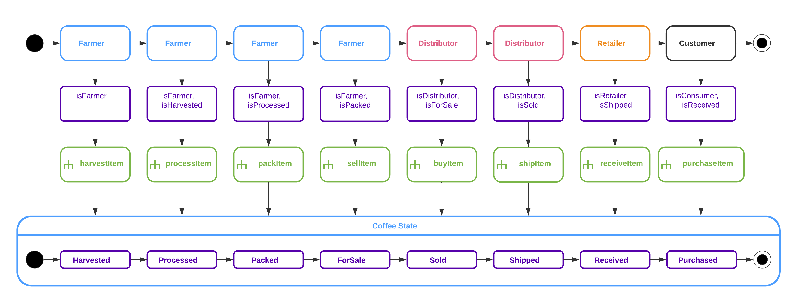
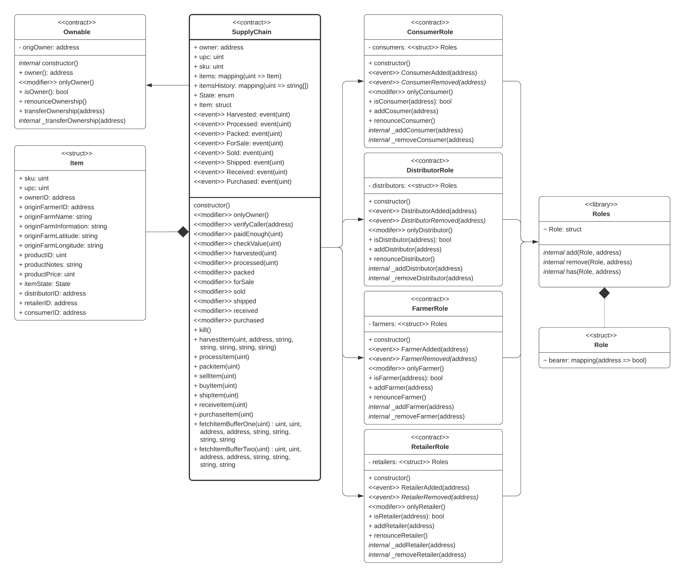

# Ethereum Dapp for Tracking Items on a Supply Chain

The write-up part of this project consists of the following elements:
- UML diagrams
- Libraries
- IPFS

**Disclaimer:**
In order to focus on the asks, I will not include steps in the different implementations that are not explicity requested. For example, If a product could not be validated successfully, it would not progress further down the process chain. The basic assumption is that everything is _just fine_ and that every participant is somehow _pre validated_. Therefore the overall process would not be used in a real world scenario, the way it is implemented for this project.

## UML Diagrams
The following diagrams are required:
- Activity Diagram
- Sequence Diagram
- State Diagram
- Class Diagram (Data Model)

### Acticity Diagram
This diagram illustrates the basic activities and the related actors (swim-lanes).\
\
The _Farmer_ is responsible to grow the plants and the process starts once the coffee beans can be harvested. The first activity is to **harvest** the coffee. Next, several **process**ing steps are executed in order to create the final product. In this example we will abstract all of those steps away and assume that all required steps are encapsulated in a single activity. Now the coffee can be **pack**ed and can be sold (**sell**) to the next actor, who is the _Distributor_.\
\
The _Distributor_ **order**s coffee from the _Farmer_ and **distribute**s the goods to the _Retailer_.\
\
The _Retailer_ gets coffee from the _Distributor_ and puts the goods for sale, so that the _Customers_ can **buy** the coffee.

### Sequence Diagram

### State Diagram

### Class Diagram

## Libraries
The following libraries and versions are used in this project:

## IPFS