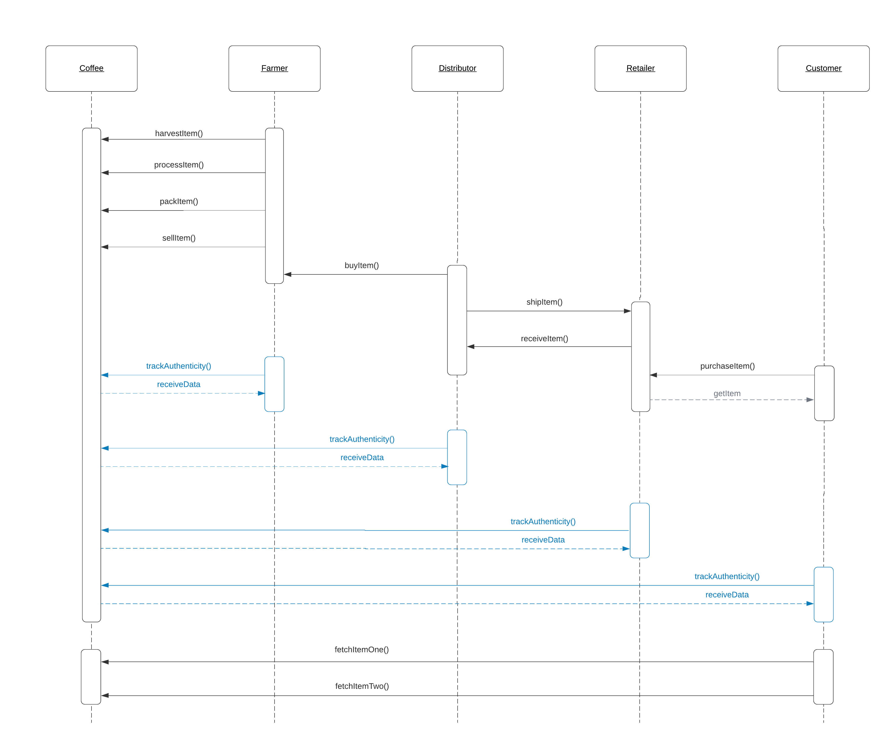

# Ethereum Dapp for Tracking Items on a Supply Chain
The write-up part of this project consists of the following elements:
- UML diagrams
- Libraries
- IPFS

**Disclaimer:**
In order to focus on the asks, I will not include steps in the different implementations that are not explicity requested. For example, If a product could not be validated successfully, it would not progress further down the process chain. The basic assumption is that everything is _just fine_ and that every participant is somehow _pre validated_. Therefore the overall process would not be used in a real world scenario, the way it is implemented for this project.

## General information
- Deployment transaction in Rinkeby: ```0xa31abe47e4fe65cec9928c555766954cbb6ecdef11b7d78e69dae7c86adf052f```
- Contract address in Rinkeby: ```0xD40471bB6cf74fFE2b6172f2e52f8EdB1e3E18Ef```
- Transation history:
```
Harvested - 0x8c2194f1790f9a6d02beb6a4a4554729edfc4877120d7a6e04f9cd256d32e187
Processed - 0x4663c5dada36d4aa7473093bf7ae5e3ad5a236aaeafd1e3b835df7f4bc6ba8ff
Packed    - 0x8db7d133c49a81222071896fc9091355fb49f4a03c1044c95acf3a4f3ebac65c
ForSale   - 0x276d71b6a2cd7070cac8564f5f578b862eeea9b118bc598ecffa0541ff58a40e
Sold      - 0x03b0d92d753f53999b28ff4678b3705c633f25a3a8a764e1e0e62993ce7a9daf
Shippped  - 0x10065f685d5e2317b9d2461f4779c045c81864d1690fa4b4fd929a9363be9b33
Received  - 0x15411aac3066b5270edda98d0f6057c93f148a009ab71e71f3fc5392082e138e
Purchased - 0x4fb9c7782be3a3abb8dc50163e7b6b518d85e2c6a9542f777f2eaa8c1bbe6966
```
- Node version    : ```v14.15.1```
- Solidity version: ```^0.4.24 (solc-js)```
- Truffle version : ```v5.1.59 (core: 5.1.59)```
- Web3.js version : ```v1.2.9```

## How to use?
- Clone this repository
```git clone <URL>```

- Install the dependencies
```switch into the <repository_base>/project directory```
```npm install```

- For testing the smart contract with truffle and mocha
```
1) Update the <base_directory>/project/truffle-config.js file according to your environment
2) From a terminal run 'truffle dev'
3) Run 'truffle migrate'
4) Run 'truffle test'
```

- For testing the web UI
```
0) Ensure that metamask is connected to the correct network and that the accounts you want to use for 
testing are connected.
1) Add your test wallet address to the different text input fields in <base_directory>/project/index.html,
e.g. '<input type="text" id="ownerID" ... value="0xb9b094e2FBa05aed9DEC6A258317171AD3F0e95b" ...'
2) Open a terminal and switch to the <base_directory>/project/src directory
3) Run 'npm run dev'
4) A website should open that you can use to interact with the smart contract. If this does not happen,
you can find the entpoint on the terminal, e.g. http://127.0.0.1:3000
5) Choose a new SKU and progress the asset through the supply chain.
```


## UML Diagrams
The following diagrams are required:
- Activity Diagram
- Sequence Diagram
- State Diagram
- Class Diagram (Data Model)

### Acticity Diagram
This diagram illustrates the basic activities and the related actors (swim-lanes).\
\
The _Farmer_ is responsible to grow the plants and the process starts once the coffee beans can be harvested. The first activity is to **harvest** the coffee. Next, several **process**ing steps are executed in order to create the final product. In this example we will abstract all of those steps away and assume that all required steps are encapsulated in a single activity. Now the coffee can be **pack**ed and can be sold (**sell**) to the next actor, who is the _Distributor_.\
\
The _Distributor_ **buy**s coffee from the _Farmer_ and then **ship**s the goods to the _Retailer_.\
\
The _Retailer_ **receive**s coffee from the _Distributor_ and puts the goods for sale, so that the _Customer_s can **purchase** the coffee.


### Sequence Diagram
This diagram illustrates the function call orders. The _blue_ parts are not implemented explicitly, but were mentioned in the project documentation.



### State Diagram
This diagram modells the interactions between Actors, the involved methods and required pre-conditions, as well as the States.


### Class Diagram
This diagram illustrates the contract structure and dependencies, as well as attributes and methods.


## Libraries
No additional libraries were used to implement this project.

## IPFS
The InterPlanetary File-System provides the ability to host our web application in a fully decentralized way. For this project it was not used.

# Local test log
```
truffle(develop)> test
Using network 'develop'.


Compiling your contracts...
===========================
> Compiling .\contracts\coffeeaccesscontrol\ConsumerRole.sol
> Compiling .\contracts\coffeeaccesscontrol\DistributorRole.sol
> Compiling .\contracts\coffeeaccesscontrol\FarmerRole.sol
> Compiling .\contracts\coffeeaccesscontrol\RetailerRole.sol
> Compiling .\contracts\coffeeaccesscontrol\Roles.sol
> Compiling .\contracts\coffeecore\Ownable.sol
> Artifacts written to C:\Users\mayer\AppData\Local\Temp\test--10144-NnqbE6ZJ2ItY
> Compiled successfully using:
   - solc: 0.4.26+commit.4563c3fc.Emscripten.clang

ganache-cli accounts used here...
Contract Owner: accounts[0]  0x5eF8Ec454583dBfb930cf38e913e0B2c344d61D2
Farmer: accounts[1]  0x8C1fC568b2A5C8796668177ce3C97D5e7993B2B9
Distributor: accounts[2]  0x16B4afC3dE80381E5fa4E9A76F5932b7e1310D36
Retailer: accounts[3]  0x428D5855563d16a4925A5Fd4B9a5d3c67306AfCE
Consumer: accounts[4]  0x3153500a431fDfFDB0c5bd77403CA6DF0d4BD412


  Contract: SupplyChain
    √ Testing farmer role assignment and revocation (547ms)
    √ Testing distributor role assignment and revocation (449ms)
    √ Testing retailer role assignment and revocation (451ms)
    √ Testing consumer role assignment and revocation (673ms)
    √ Add roles for downstream tests (900ms)
    √ Testing smart contract function harvestItem() that allows a farmer to harvest coffee (780ms)
    √ Testing smart contract function processItem() that allows a farmer to process coffee (433ms)
    √ Testing smart contract function packItem() that allows a farmer to pack coffee (403ms)
    √ Testing smart contract function sellItem() that allows a farmer to sell coffee (528ms)
    √ Testing smart contract function buyItem() that allows a distributor to buy coffee (531ms)
    √ Testing smart contract function shipItem() that allows a distributor to ship coffee (494ms)
    √ Testing smart contract function receiveItem() that allows a retailer to mark coffee received (601ms)
    √ Testing smart contract function purchaseItem() that allows a consumer to purchase coffee (490ms)
    √ Testing smart contract function fetchItemBufferOne() that allows anyone to fetch item details from blockchain (587ms)
    √ Testing smart contract function fetchItemBufferTwo() that allows anyone to fetch item details from blockchain (567ms)


  15 passing (9s)
```

# Rinkeby Deployment Log
```
truffle(develop)> truffle migrate --reset --network rinkeby

Compiling your contracts...
===========================
> Compiling .\contracts\coffeeaccesscontrol\ConsumerRole.sol
> Compiling .\contracts\coffeeaccesscontrol\DistributorRole.sol
> Compiling .\contracts\coffeeaccesscontrol\FarmerRole.sol
> Compiling .\contracts\coffeeaccesscontrol\RetailerRole.sol
> Compiling .\contracts\coffeeaccesscontrol\Roles.sol
> Compiling .\contracts\coffeecore\Ownable.sol
> Artifacts written to E:\git-repositories\bitcoin-nanodegree-projects\und-project3\project\build\contracts
> Compiled successfully using:
   - solc: 0.4.26+commit.4563c3fc.Emscripten.clang


Migrations dry-run (simulation)
===============================
> Network name:    'rinkeby-fork'
> Network id:      4
> Block gas limit: 10000000 (0x989680)


1_initial_migration.js
======================

   Deploying 'Migrations'
   ----------------------
   > block number:        7901169
   > block timestamp:     1610745336
   > account:             0xb9b094e2FBa05aed9DEC6A258317171AD3F0e95b
   > balance:             18.7057044809999
   > gas used:            223594 (0x3696a)
   > gas price:           10 gwei
   > value sent:          0 ETH
   > total cost:          0.00223594 ETH

   -------------------------------------
   > Total cost:          0.00223594 ETH


2_deploy_contracts.js
=====================

   Deploying 'FarmerRole'
   ----------------------
   > block number:        7901171
   > block timestamp:     1610745344
   > account:             0xb9b094e2FBa05aed9DEC6A258317171AD3F0e95b
   > balance:             18.7009806209999
   > gas used:            445038 (0x6ca6e)
   > gas price:           10 gwei
   > value sent:          0 ETH
   > total cost:          0.00445038 ETH


   Deploying 'DistributorRole'
   ---------------------------
   > block number:        7901172
   > block timestamp:     1610745351
   > account:             0xb9b094e2FBa05aed9DEC6A258317171AD3F0e95b
   > balance:             18.6965295209999
   > gas used:            445110 (0x6cab6)
   > gas price:           10 gwei
   > value sent:          0 ETH
   > total cost:          0.0044511 ETH


   Deploying 'RetailerRole'
   ------------------------
   > block number:        7901173
   > block timestamp:     1610745357
   > account:             0xb9b094e2FBa05aed9DEC6A258317171AD3F0e95b
   > balance:             18.6920787809999
   > gas used:            445074 (0x6ca92)
   > gas price:           10 gwei
   > value sent:          0 ETH
   > total cost:          0.00445074 ETH


   Deploying 'ConsumerRole'
   ------------------------
   > block number:        7901174
   > block timestamp:     1610745364
   > account:             0xb9b094e2FBa05aed9DEC6A258317171AD3F0e95b
   > balance:             18.6876280409999
   > gas used:            445074 (0x6ca92)
   > gas price:           10 gwei
   > value sent:          0 ETH
   > total cost:          0.00445074 ETH


   Deploying 'SupplyChain'
   -----------------------
   > block number:        7901175
   > block timestamp:     1610745384
   > account:             0xb9b094e2FBa05aed9DEC6A258317171AD3F0e95b
   > balance:             18.6568060109999
   > gas used:            3082203 (0x2f07db)
   > gas price:           10 gwei
   > value sent:          0 ETH
   > total cost:          0.03082203 ETH

   -------------------------------------
   > Total cost:          0.04862499 ETH


Summary
=======
> Total deployments:   6
> Final cost:          0.05086093 ETH


Starting migrations...
======================
> Network name:    'rinkeby'
> Network id:      4
> Block gas limit: 10000000 (0x989680)


1_initial_migration.js
======================

   Deploying 'Migrations'
   ----------------------
   > transaction hash:    0x087cdc57e02cff95a1e003e3c3004fbdcf532655db51c80d49f5cf28df76f5c8
   > Blocks: 1            Seconds: 16
   > contract address:    0x114A1A6BA3e7f321Db4dcB230c1D16852E6C5d72
   > block number:        7901173
   > block timestamp:     1610745435
   > account:             0xb9b094e2FBa05aed9DEC6A258317171AD3F0e95b
   > balance:             18.7055544809999
   > gas used:            238594 (0x3a402)
   > gas price:           10 gwei
   > value sent:          0 ETH
   > total cost:          0.00238594 ETH


   > Saving migration to chain.
   > Saving artifacts
   -------------------------------------
   > Total cost:          0.00238594 ETH


2_deploy_contracts.js
=====================

   Deploying 'FarmerRole'
   ----------------------
   > transaction hash:    0xa3aa59961da8f97ad6f521044aa17c5f53fc95340a7128386b56c677a444a5db
   > Blocks: 1            Seconds: 12
   > contract address:    0xC3eeBcA36D5790141c939A5B1CB867Dfe886b3F2
   > block number:        7901175
   > block timestamp:     1610745465
   > account:             0xb9b094e2FBa05aed9DEC6A258317171AD3F0e95b
   > balance:             18.7005306209999
   > gas used:            460038 (0x70506)
   > gas price:           10 gwei
   > value sent:          0 ETH
   > total cost:          0.00460038 ETH


   Deploying 'DistributorRole'
   ---------------------------
   > transaction hash:    0xe22b8ebd963c406f85ca5d102f32aafaa76bdcfeab8a5c0f2575476555edc819
   > Blocks: 1            Seconds: 12
   > contract address:    0x74C3Ecfa772e29F0F53924e23cd891eb4c6896b0
   > block number:        7901176
   > block timestamp:     1610745480
   > account:             0xb9b094e2FBa05aed9DEC6A258317171AD3F0e95b
   > balance:             18.6959295209999
   > gas used:            460110 (0x7054e)
   > gas price:           10 gwei
   > value sent:          0 ETH
   > total cost:          0.0046011 ETH


   Deploying 'RetailerRole'
   ------------------------
   > transaction hash:    0xfdc209a7d28a008b30f610fdae3788e7835901f7f382cf17b0f7eb3eedf081b4
   > Blocks: 0            Seconds: 8
   > contract address:    0xbfd3E8303D667108414F017f73446650f249b688
   > block number:        7901177
   > block timestamp:     1610745495
   > account:             0xb9b094e2FBa05aed9DEC6A258317171AD3F0e95b
   > balance:             18.6913287809999
   > gas used:            460074 (0x7052a)
   > gas price:           10 gwei
   > value sent:          0 ETH
   > total cost:          0.00460074 ETH


   Deploying 'ConsumerRole'
   ------------------------
   > transaction hash:    0x10efa43bc8f6562345cdefd9df767ed042c93f58ec86ce58bc0752bff6f580bb
   > Blocks: 0            Seconds: 8
   > contract address:    0x2D925563aC5832C17fde751F5A85Aa782178aBCD
   > block number:        7901178
   > block timestamp:     1610745510
   > account:             0xb9b094e2FBa05aed9DEC6A258317171AD3F0e95b
   > balance:             18.6867280409999
   > gas used:            460074 (0x7052a)
   > gas price:           10 gwei
   > value sent:          0 ETH
   > total cost:          0.00460074 ETH


   Deploying 'SupplyChain'
   -----------------------
   > transaction hash:    0xa31abe47e4fe65cec9928c555766954cbb6ecdef11b7d78e69dae7c86adf052f
   > Blocks: 0            Seconds: 8
   > contract address:    0xD40471bB6cf74fFE2b6172f2e52f8EdB1e3E18Ef
   > block number:        7901179
   > block timestamp:     1610745525
   > account:             0xb9b094e2FBa05aed9DEC6A258317171AD3F0e95b
   > balance:             18.6548560109999
   > gas used:            3187203 (0x30a203)
   > gas price:           10 gwei
   > value sent:          0 ETH
   > total cost:          0.03187203 ETH


   > Saving migration to chain.
   > Saving artifacts
   -------------------------------------
   > Total cost:          0.05027499 ETH


Summary
=======
> Total deployments:   6
> Final cost:          0.05266093 ETH
```